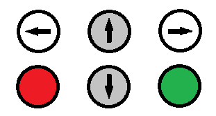
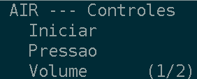
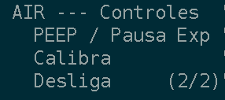
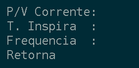
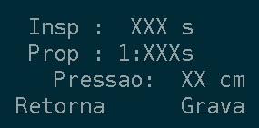
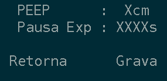

# AIR ONE - INSTRUCOES DE USO DE INTERFACE

## Navegação e funcionalidades de botões

O design da interface do AIR ONE foi pensado para trazer
maior facilidade de uso para a parametrização das variáveis
de controle comumente utilizados na ventilação mecânica.

Como pode observar na __Figura 1__ os botões são em formato
direcional, com o objetivo de deixar a navegação intuitiva.

Para melhor entendimento dos botões, serâo chamados conforme suas respectivas
funcionalidades:

- ESQUERDA (branco)
- CIMA     (cinza)
- DIREITA  (branco)
- BAIXO    (cinza)
- ANULA    (vermelho)
- CONFIRMA (verde)

### Iniciando: Menu Controles - Primeira Página

Ao iniciar o AIR ONE, o menu de controle presente na __Figura 6__
aparecerá. O usuário então pode usar os botões CIMA e BAIXO
para escolher dentre as opções presentes no menu, além disso
pode passar para a próxima página usando o botão DIREITA e
acessar um menu de parametrização com o botão CONFIRMA
(verde)(Ver __Iniciando: Menu Controles - Segunda Página__).

Caso deseje usar a configuração de fábrica, o operador
seleciona a opção __Iniciar__ (Ver __Tela de Acompanhamento__).

### Iniciando: Menu Controles - Segunda Página

A segunda página do menu de controle, presente na __Figura 7__, possui funções
de calibragem de PEEP/Pausa inspiratória, Calibragem geral, e Desligamento da
ventilação mecânica. O usuário então pode usar os botões CIMA e BAIXO
para escolher dentre as opções presentes no menu, além disso
pode passar para a página anterior usando o botão ESQUERDA e
selecionar uma opção de controle através do botão CONFIRMA.
(verde)(Ver __Iniciando: Menu Controles - Segunda Página__).

Caso deseje encerrar a ciclagem respiratória, o operador
seleciona a opção __Desliga__.

## Tela de Acompanhamento

Ao iniciar pela configuração de fábrica ou gravar um tipo de controle, a
interface mostrará um conjunto de dados, representados pela __Figura 5__. Nessa
etapa, o operador poderá acompanhar os valores configurados.

Ao iniciar o AIR ONE pela primeira vez, é necessário pressionar o botão
CONFIRMAR (verde), para que se dê início à ciclagem ventilatória.

## Menu de parametrização

Os menus de parametrização do AIR ONE destinam-se a alterar
valores no controle respiratório.

### Controle respiratório por Pressão

As configurações disponíveis para o controle por Pressão,
como podem ser vistas na __Figura 2__ são: o tempo de inspiração
e a proporção Inspiração/Espiração.  Para alterar um dos
parâmetros, o operador deve utilizar os botões CIMA e BAIXO,
movendo o cursor (representado pelo símbolo __→__) até a
variável desejada.

Para se prevenir de calibragens incorretas ou possíveis
equívocos, o Ventilador mecânico AIR ONE conta com a
possibilidade de cancelar a parametrização, apertando o
botão ANULA (vermelho). Além disso, o AIR ONE possui também
valores limites de configuração, impossibilitando uma
configuração errônea ou absurda.

Os limites do menu de regulação por pressão são os seguintes:

- Tempo Inspiratório: de 0,9s até 1,8 segundos, com passo de 0,1s
- Proporção Inspiração/Espiração: de 1:1 a 1:3, com passo de 0,2s

### Controle respiratório por Volume

As configurações disponíveis para o controle por Volume,
como podem ser vistas na __Figura 3__ são: o volume corrente, o tempo de
inspiração, a proporção Inspiração/Espiração.  Para alterar um dos parâmetros,
o operador deve utilizar os botões CIMA e BAIXO, movendo o cursor (representado
pelo símbolo __→__) até a variável desejada.

Para se prevenir de calibragens incorretas ou possíveis
equívocos, o Ventilador mecânico AIR ONE conta com a
possibilidade de cancelar a parametrização, apertando o
botão ANULA (vermelho). Além disso, o AIR ONE possui também
valores limites de configuração, impossibilitando uma
configuração errônea ou absurda.

Os limites do menu de regulação por volume são os seguintes:

- Volume: de 150mL até 300 mL, com passo de 10mL 
- Tempo Inspiratório: de 0,9s até 1,8 segundos, com passo de 0,1s
- Proporção Inspiração/Espiração: de 1:1 a 1:3, com passo de 0,2s

### Controle de PEEP e Pausa inspiratória

O menu de calibragem da PEEP e da pausa inspiratória tem o leiaute presente
pela __Figura 4__. Para alterar um dos parâmetros, o operador deve utilizar os
botões CIMA e BAIXO, movendo o cursor (representado pelo símbolo __→__) até a
variável desejada.

Para se prevenir de calibragens incorretas ou possíveis
equívocos, o Ventilador mecânico AIR ONE conta com a
possibilidade de cancelar a parametrização, apertando o
botão ANULA (vermelho). Além disso, o AIR ONE possui também
valores limites de configuração, impossibilitando uma
configuração errônea ou absurda.

Os limites do menu de regulação da PEEP e da pausinspiratória são os seguintes:

- PEEP: de 3cmH2O até 5cmH2O
- Pausa Inspiratória: 0,35s a 0,50s

## Recomendações de manutenção

No momdngo o menu de Calibragem não executa nenhum comando no ventilador,
futuramente será uma opção apenas para técnicos e responsáveis pelo equipamento
realizarem.

Também recomenda-se fazer a configuração manual dos controles ventilatórios, e,
sempre que possível, evitar o controle regulado de fábrica da ventilação do AIR
ONE, pois cada paciente precisa de parâmetros diferentes.

A equipe técnica de P&D do Aparelho de Interface Respiratória - AIR não se
responsabiliza por danos causados em pacientes devido a má regulagem ou mau uso,
desprezando as recomendações presentes no manual de operação.
